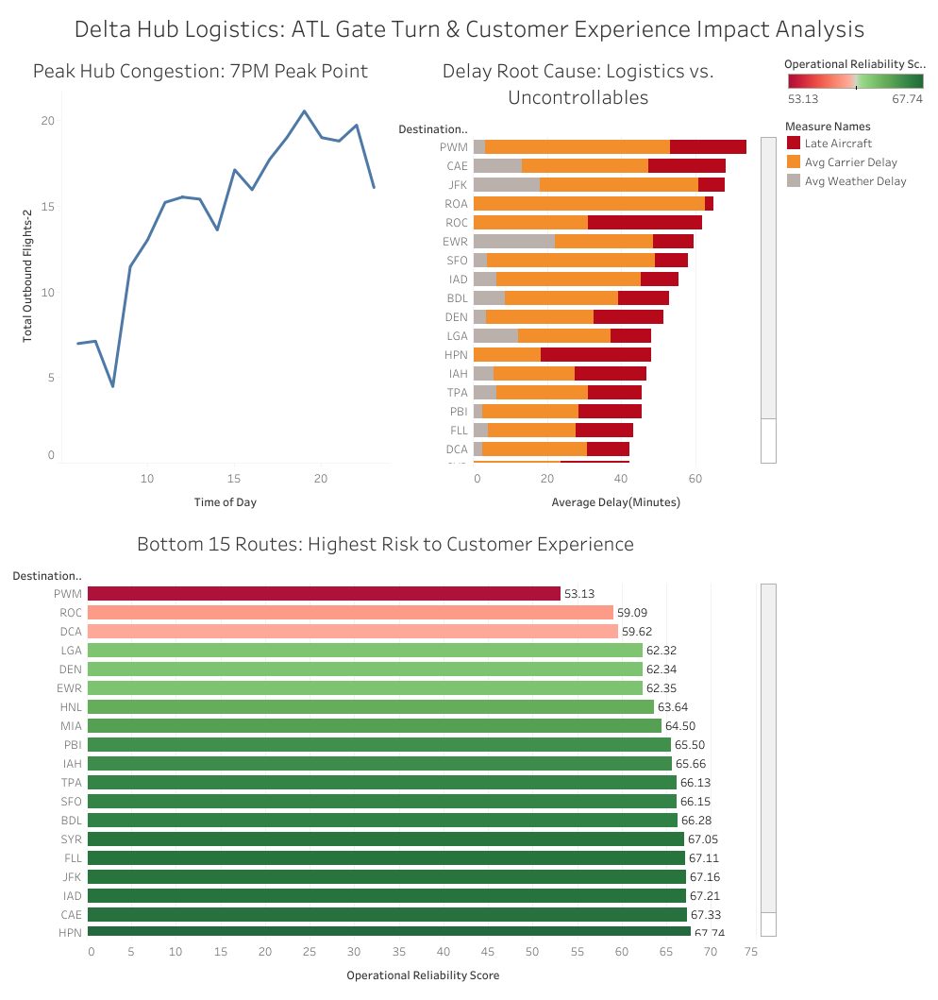

# Delta Hub Logistics: ATL Gate Turn & Customer Experience Impact Analysis

## Executive Summary
This project analyzes operational bottlenecks and the propagation of flight delays at Hartsfield-Jackson Atlanta International Airport (ATL). Using PostgreSQL and Tableau, I engineered a data pipeline to process over 30,000 flight records from the Bureau of Transportation Statistics, identifying specific logistical breaking points that negatively impact the Transaction Experience Rate (TXR) for passengers.

## The Dashboard

## Business Logic & SQL Engineering
I utilized PostgreSQL window functions and conditional aggregations to isolate operational inefficiencies. The analysis focused on separating uncontrollable variables (weather) from actionable logistics failures (late aircraft cascading delays).

**Key Queries:**
* **The Hub Stress Test:** Calculated hourly failure rates to identify the exact time of day when gate-turn logistics break down.
* **The Reliability Scorecard:** Filtered noise using `HAVING` clauses to rank destination routes by their overall operational reliability, acting as a predictive proxy for customer satisfaction (TXR).

## Key Insights for Operations Management
**The 7:00 PM Bottleneck:** Hub congestion and delay propagation reach critical mass in the early evening. The data reveals that minor logistical inefficiencies throughout the day cascade and compound, peaking at 19:00 (7:00 PM) and causing a severe spike in departure delays that threaten evening customer experience. 

**Late Aircraft Cascading:** While weather accounts for a portion of delays, the data reveals that poor turnaround efficiency at the gate ("Late Aircraft Delay") is the primary driver of TXR failure on low-performing routes.

**Resource Allocation:** By shifting ground-crew resources to anticipate the mid-afternoon bottleneck, overall hub reliability could be improved, directly protecting the customer experience.

